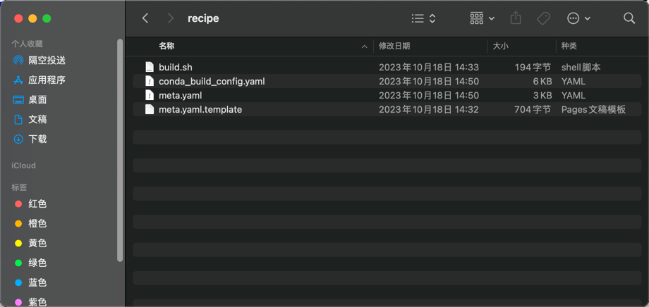

## Anaconda安装 (ARM)

1. 获取Anaconda安装脚本:
```
wget --user-agent="Mozilla/5.0 (Windows NT 10.0; WOW64) AppleWebKit/537.36 (KHTML, like Gecko) Chrome/51.0.2704.103 Safari/537.36" https://mirrors.tuna.tsinghua.edu.cn/anaconda/archive/Anaconda3-2023.09-0-Linux-aarch64.sh
```
2. bash ./Anaconda3-2023.09-0-Linux-aarch64.sh
3. source ~/.bashrc
4. 验证: conda --version 返回版本即安装成功, 不用再执行第五步了
```shell
(base) [root@DC1-09-007 ~]# conda --version
conda 23.7.4
```
5. 如果source ~/.bashrc执行失败,conda --version没有返回值可以尝试直接创建软连接:
```
cd /usr/bin/
ln -s /root/anaconda3/bin/conda conda
```

## 环境配置(必须执行, 否则conda build .等构建安装命令大概率失败)
1. conda 添加channel, 使得在bioconda和conda-forge仓库的软件和本地构建的软件都能找到
```shell
conda config --add channels https://conda.anaconda.org/bioconda/linux-aarch64
conda config --add channels https://conda.anaconda.org/bioconda/noarch
conda config --add channels https://conda.anaconda.org/conda-forge/linux-aarch64
conda config --add channels https://conda.anaconda.org/conda-forge/noarch
conda config --add channels file:///root/anaconda3/conda-bld
```
2. 修改配置文件内容: vim ~/.condarc

```shell
channels:
  - conda-forge
  - bioconda
  - defaults
  - conda-bld
custom_channels:
  conda-bld: file:///root/anaconda3
report_errors: true
channel_priority: strict
```

## 本地构建和安装测试
1. 先到github网站fork一下孙骞的这个仓库: https://github.com/sunqian2116/bioconda-recipes
2. 然后在你申请的鲲鹏服务器上执行git clone 你fork的仓库地址
3. 你clone后的目录下应该有以下内容, 其中你要适配的软件都在recipes目录下
```shell
(base) [root@DC1-09-007 ~]# cd /home/bioconda-recipes-master/
(base) [root@DC1-09-007 bioconda-recipes-master]# ll
total 404
-rw-------    1 root root   4569 Apr  9 23:12 azure-pipeline-master.yml
-rw-------    1 root root   4806 Apr  9 23:12 azure-pipeline-nightly.yml
-rw-------    1 root root   7723 Apr  9 23:12 azure-pipeline.yml
-rw-------    1 root root  26072 Apr  9 23:12 build-fail-blacklist
-rw-------    1 root root    310 Apr  9 23:12 config.yml
-rw-------    1 root root    113 Apr  9 23:12 CONTRIBUTING.md
-rw-------    1 root root     93 Apr  9 23:12 FAQs.md
-rw-------    1 root root    133 Apr  9 23:12 GUIDELINES.md
-rw-------    1 root root   1090 Apr  9 23:12 LICENSE
drwx------    3 root root   4096 Apr  9 23:12 logo
-rw-------    1 root root    848 Apr  9 23:12 README.md
drwx------ 9119 root root 323584 Apr  9 23:12 recipes
drwx------    4 root root   4096 Apr  9 23:12 scripts
```
4. 以 bayestyper 软件适配为例(一般有一个构建脚本build.sh和一个配置文件meta.yaml)
```shell
(base) [root@DC1-09-007 bioconda-recipes-master]# cd recipes/bayestyper
(base) [root@DC1-09-007 bayestyper]# ll
total 8
-rw------- 1 root root 195 Apr 10 15:50 build.sh
-rw------- 1 root root 827 Apr 10 15:51 meta.yaml
```
5. meta.yaml解析
```shell
package:
  name: bayestyper
  version: {{ version }}

build:
  number: 2  # 这个数字一般如果我们提交代码重新构建的话,要加1
  skip: True
  # run_exports这个要配置上, 不然提交可能check不通过
  run_exports: 
    - {{ pin_subpackage(name|lower) }}

source:
  url: https://github.com/bioinformatics-centre/BayesTyper/archive/v{{ version }}.tar.gz
  sha256: 917cd1b1ca7b5cfb6b8327138515ca1ad70878f0c4e8df393fddcbe42f281e14

requirements:
  build: # 构建需要的软件
    - make
    - {{ compiler('cxx') }}
    - cmake
  host: # 这不知道啥鸟意思
    - zlib
    - boost-cpp
  run: # 运行时需要的软件
    - zlib
    - boost-cpp

about:
  home: https://github.com/bioinformatics-centre/BayesTyper
  license: MIT
  summary: A method for variant graph genotyping based on exact alignment of k-mers

test: # 测试安装是否成功的命令(你们截图要截图的命令在这)
  commands:
    - bayesTyper | grep BayesTyper
    - bayesTyperTools | grep BayesTyperTools

# 一般我们要加这个extra配置,指示aarch64架构也支持,但是如果在build下已经指示是noarch了,就不要加这个了
extra: 
  additional-platforms:
    - linux-aarch64
```
6. 适配bayestyper 我们首先先去kunpeng_conda仓找对应的软件,并下载下来
> https://mirrors.huaweicloud.com/kunpeng/archive/Kunpeng_conda/
7. 打开下载文件的info/recipes目录

8. 一般是是要把下载文件的meta.yaml.template替换git clone下载的meta.yaml, build.sh替换git clone下载的build.sh
9. meta.yaml 需要额外补充extra和run_exports,(详见第5步)
10. 之后就是在当前目录执行conda build . 开始构建
```shell
(base) [root@DC1-09-007 bayestyper]# ll
total 8
-rw------- 1 root root 195 Apr 10 15:50 build.sh
-rw------- 1 root root 827 Apr 10 15:51 meta.yaml
(base) [root@DC1-09-007 bayestyper]# conda build .

# 一般有下面这个结果就表示build成功
To remove them, you can run the ```conda build purge``` command
```

11. 如果构建成功则进行验证
```shell
conda create -n bayestyper -y 

conda activate bayestyper # 到bayestyper这个conda环境

conda install bayestyper # 执行本地安装

# 如何进行验证: 写在meta.yaml 的test里, 看test是如何验证的
bayesTyper | grep BayesTyper # 有正常的返回显示则表示成功
# 注意如果是Python包,则可以python进到python环境,然后import 对应的包进行验证

conda deactivate # 退出当前conda环境
```
12. 验证成功后提交代码到仓库中,新建PR,然后把验证成功的截图上传上去就行了.


FAQ:
## 有构建问题让文尧给你们拉倒bioconda群里咨询
## 不会可以先咨询文尧

## 下面的没啥用,不用看
## conda 路径记录
- 源码包下载位置: /root/anaconda3/conda-bld/src_cache
- conda 配置: conda config --show

## conda 本地构建
- git clone https://github.com/bioconda/bioconda-recipes.git
- 在目录下/home/guozhicong/bioconda-recipes/recipes/afplot 执行 conda build . 或者conda build ./meta.yaml 进行构建
- 构建完会在目录下/root/anaconda3/conda-bld生成压缩包, 失败也有相应的broken文件等 (find / -name conda-bld)

## conda 本地安装
```shell
# 在XXX.tar.bz2对应的目录下执行
conda install --use-local XXX.tar.bz2
```
